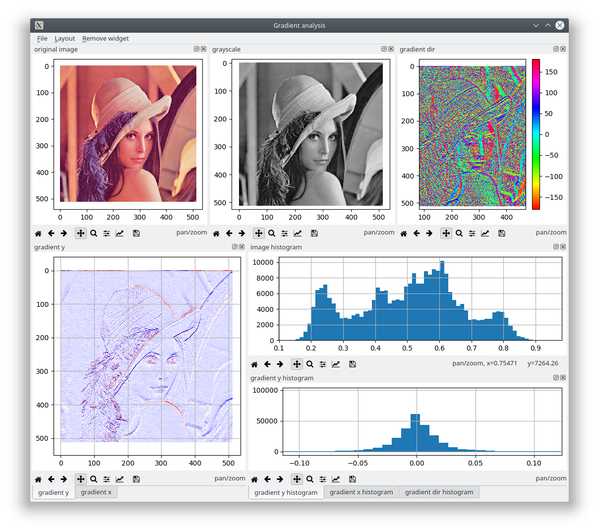
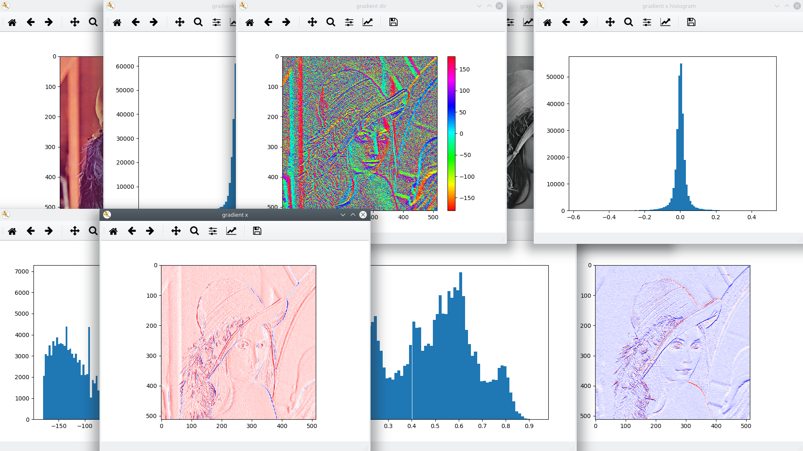

# Mpldock
A matplotlib backend that makes figures dockable.

# Motivation
Work with something like this:

instead of that:


# Features
* Trivial integration - it is enough to change a matplotlib backend
* Arrange figures into a convenient layout with drag and drop
* Integrate mainloop with ipython, jupyter, pycharm console (or run as a standalone application)
* Preserve a layout and user-modifier state (scale, grid, etc.) through consecutive runs


# Installation
```
pip install mpldock
```
# Usage
## Example
The simplest example with layout persistence:
```python
import matplotlib.pyplot as plt
from mpldock import persist_layout

plt.switch_backend('module://mpldock.backend')
persist_layout('1e2682b5-4408-42a6-ae97-3c11332a96fa')

plt.figure("some plot")
plt.plot([1, 5, 3])
plt.figure("another plot")
plt.plot([5, 0, 1])

plt.show()

``` 
## Set a backend
Set a matplotlib backend to `module://mpldock.backend`. See [this](https://matplotlib.org/faq/usage_faq.html?highlight=backend#what-is-a-backend) for more.

E.g.:
```python
import matplotlib
matplotlib.use('module://mpldock.backend')  # must be done before importing pyplot
import matplotlib.pyplot as plt
```

Or (does not work with jupyter):
```python
import matplotlib.pyplot as plt
plt.switch_backend('module://mpldock.backend')
```

Also using a global configuration (like `matplotlibrc` file or `MPLBACKEND` environment variable) works but not in jupyter or pycharm console, since they hack around many things.

## Integrate mainloop (if desired)
In a standalone application it is enough to use typical:
```python
plt.show()
```
at the end of script, which starts a mainloop and blocks until the application is finished.

In an ipython or jupyter a `gui` magic may be used:
```
%gui qt5
```

## Layout persistence
In order to preserve a layout between application runs, additional line must be added:
```python
from mpldock import persist_layout
persist_layout('my_super_unique_identifier')
```
The layout is saved after closing a window or when done manually from a menu (`Layout`/`Save`). The string identifier
 should be different for each application (scripts with the same identifier share the layout).

## More
See [examples](examples) for more.

# Major dependencies
* Python >= 3.6
* PyQt5 (PySide, PyQt4 coming soon)
* Matplotlib
